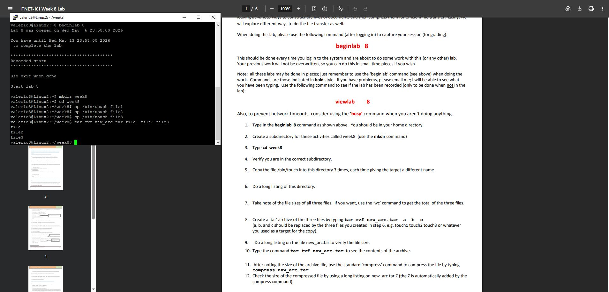
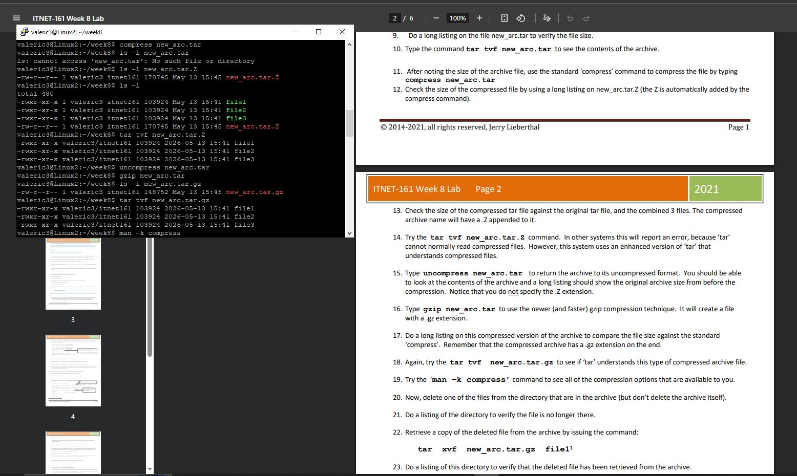
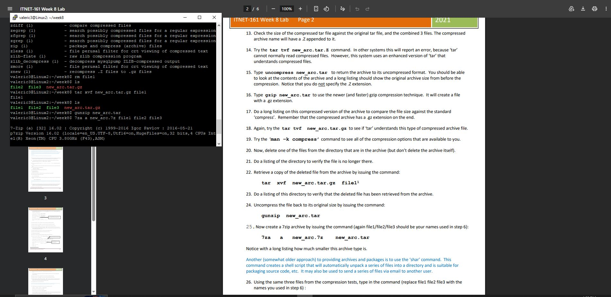
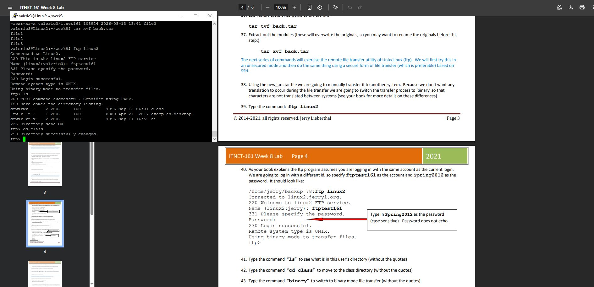

### Lab Step 1: Environment Setup

*Initial Environment Setup: Created a dedicated lab directory and prepared multiple sample files.*

### Lab Step 2: Archiving Processes

Archive Compression and Inspection: Utilizing compress and gzip to reduce file sizes, followed by using the tar command with specific flags (tvf) to inspect the contents of compressed archives without extracting them.

### Lab Step 3: Compression Analysis

Advanced Archiving and File Recovery: Executing 7za for high-ratio compression and demonstrating the tar xvf command to selectively retrieve and restore deleted files from an existing archive.

### Lab Step 4: Remote Transfer

Remote File Transfer (FTP): Establishing an active FTP session to a remote Linux server, navigating the remote directory structure, and preparing for secure file transmission.
