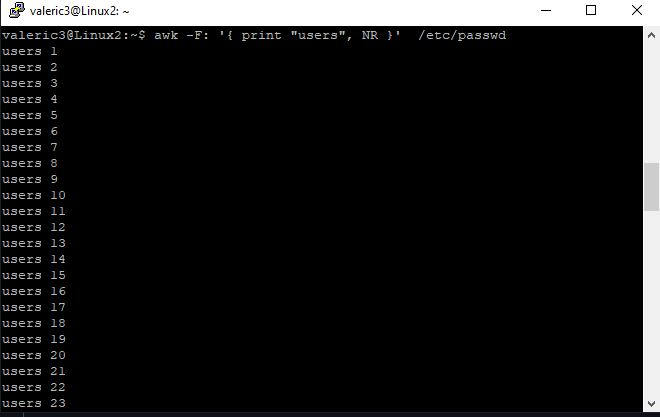
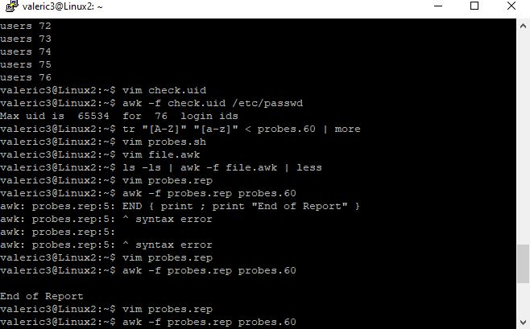

# Awk Lab: Remote Server Administration

This lab was performed via **PuTTY** by connecting to a remote **SSH server**. It demonstrates the ability to manage remote Linux environments and process system data.

---

**Description:** Using `awk` with the `NR` variable to count every user account on the remote server's `/etc/passwd` file.

---

**Description:** Executing a script file (`check.uid`) on the remote host. This screenshot captures the troubleshooting process where I used **vim** to fix a syntax error in the script before successfully generating the final report.

---

### Skills Used
* **Remote Administration:** Connecting and working via PuTTY/SSH.
* **Data Filtering:** Extracting data from server configuration files.
* **Troubleshooting:** Resolving script errors in a live terminal environment.
* **Vim:** Editing files directly on a remote Linux host.
