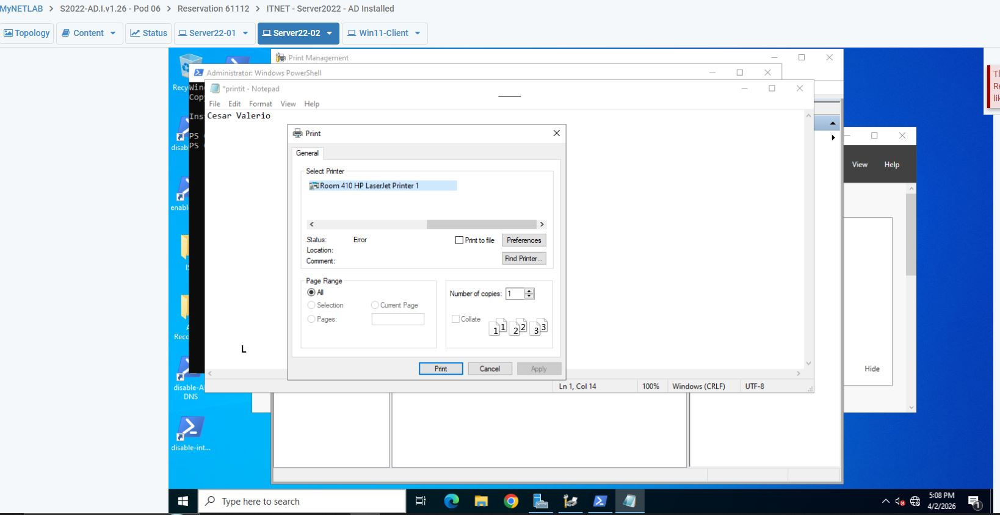
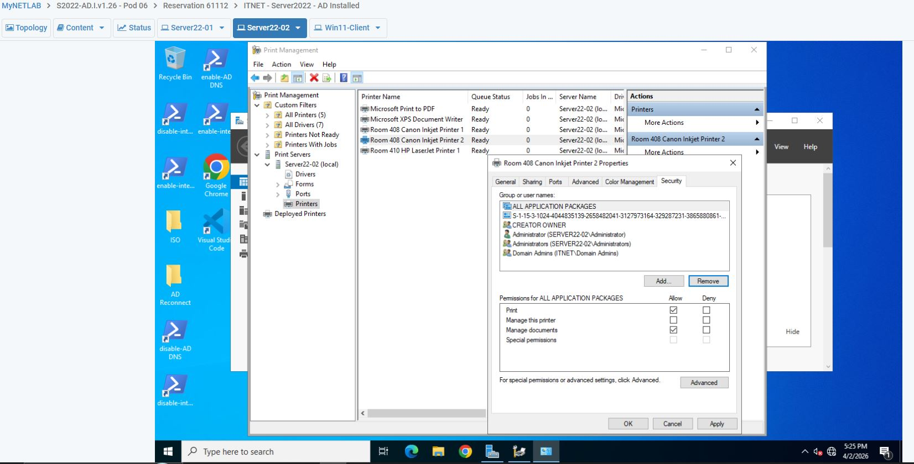
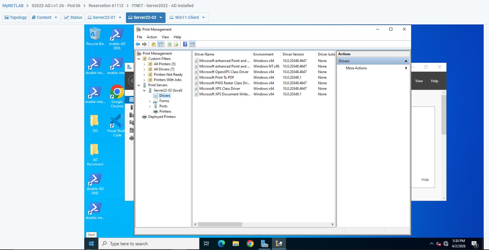
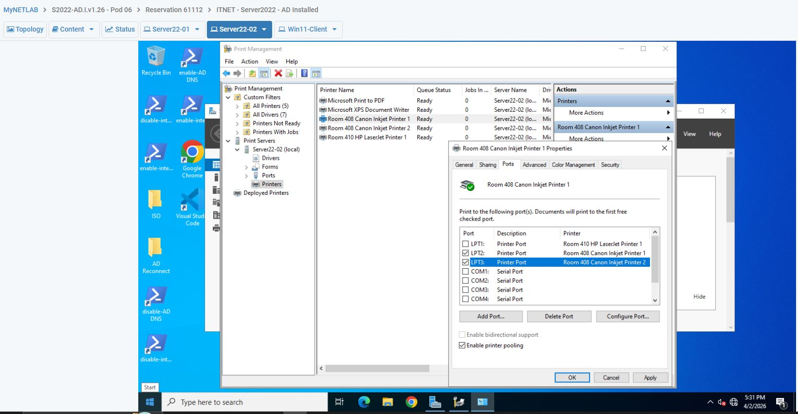

# Lab: Print Server Configuration

**Description:** Testing the printer connection by sending a print job from a Notepad file to the HP LaserJet.

---

**Description:** Configuring security settings and user permissions to control who is allowed to manage documents and print.

---

**Description:** Managing the Print Server drivers to ensure the correct software is installed for various printer models.

---

**Description:** Setting up printer pooling across multiple ports to balance the workload between different printers.
